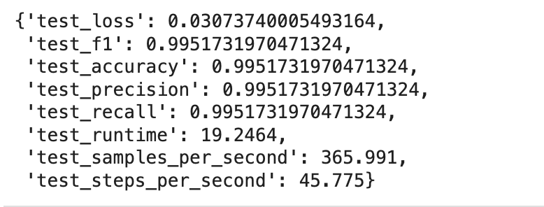
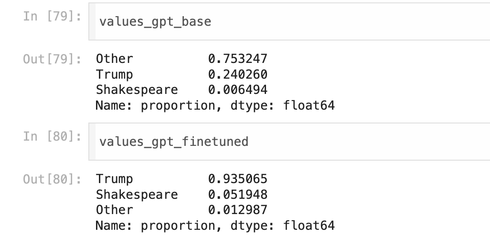
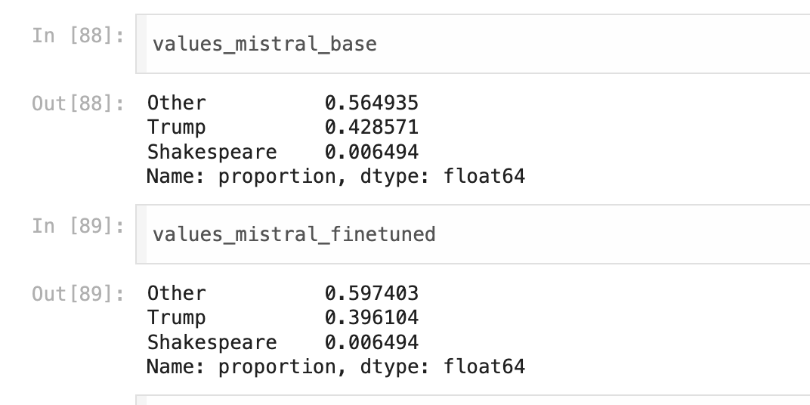
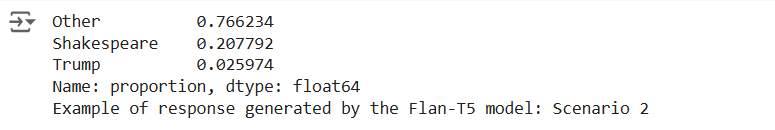
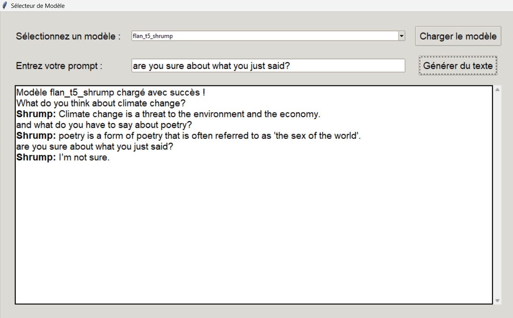
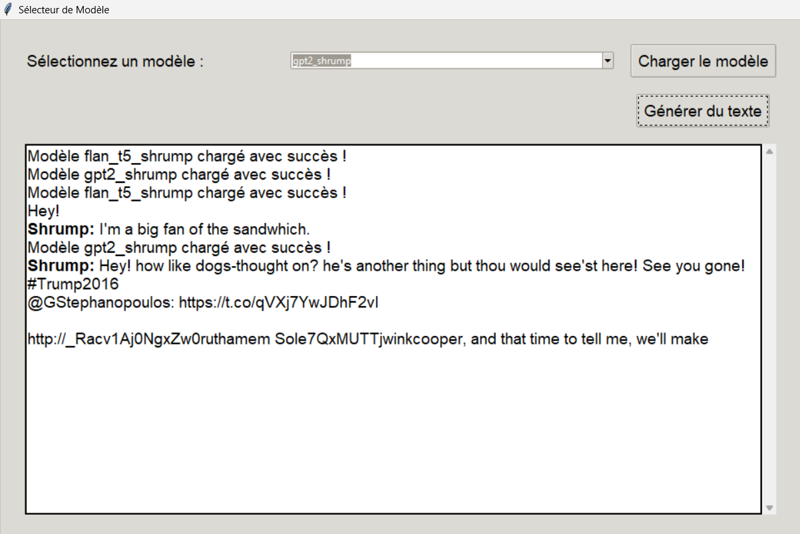

# Shrump 
Finetuning of different large language models on a mixed dataset of Shakespeare quotes and Trump tweets

 

## The project
The goal of the project is to finetune some language models to make them generate text in a mixed style of Trump and Shakespeare. We did this on three different models: GPT-2, FLAN-T5 and Mistral-7b. Next, we measured the performance of the different models through a BERT text classifier applied to the generated texts. 

 

## Data

The final dataset used for training comes from the union of a dataset on Shakespeare and one on Trump.   
For Shakespeare, the data were taken from [here](https://www.kaggle.com/datasets/kingburrito666/shakespeare-plays)  
For Trump, the data were taken from [here](https://www.kaggle.com/datasets/kingburrito666/better-donald-trump-tweets/data).

The data were merged and balanced according to the number of tokens present for the two authors. In this way, at the end in the balanced dataset each author has about the same number of tokens. The code used to do that is in `Dataset/Dataset_code/Data_Balancing.ipynb`. The final dataset has two columns, one with the text and one with the author (Shakespeare or Trump).

The balanced dataset was saved in the `Divided_Dataset` folder by splitting it into the canonical "train, test, validation" division.   
Also in the same folder are the files `I_train.csv`, `I_test.csv` and `I_validation.csv`. These were created with the code in `Dataset/Dataset_code/Dataset_Integration.ipynb`. This is the dataset used to train a BERT classifier, in order to classify a text according to its author: Trump, Shakespeare, Other. These files therefore contain quotes from Trump, Shakespeare and other authors. These were taken from [this dataset](https://huggingface.co/datasets/sentence-transformers/parallel-sentences-news-commentary) on english news.

 

## Training

Due to computational limitations, we could not guarantee consistent training of the various models in terms of hyperparameters. 

GPT-2, for example, was trained on 3 epochs using the total training data.

Mistral-7b, on the other hand, was trained on only 1 epoch and 10% of the total training data. 

FLAN was trained on 3 epoch on 10% of the total training data.

## Performance evaluation

To measure the performance of the models after finetuning, we trained a BERT text classifier on a set of texts by Trump, Shakespeare and various authors. At the end of the training, the classifier was able to label a text according to its author: "Shakespeare", "Trump", "Other". The model was trained on a dataset of about 32 thousand text excerpts over three epochs. Below are the metrics after training. 

We then generated a series of texts using the various models-both finetuned and basic versions. The prompts we used were taken from the multitask evaluation dataset created in
<i>Measuring Massive Multitask Language Understanding</i> by Dan Hendrycks et al. (ICLR 2021). We used only 10% of the prompts, i.e. 154 prompts of very different topics. 
  

Once the responses were generated with the various models, we applied the classifier to see the effects of finetuning. Ideally, the classifier should have identified Trump or Shakespeare as the authors of most of the texts generated by the finetuned models.

This was the case for GPT-2. These are the results of the performance test:

Trump was recognized as the author of 93% of the texts generated by the finetuned model, while it was only 24% for the base model. 

  

Mistral-7b finetuning's performance was not as good. 

"Other" is labeled as the author of more than half the texts. Paradoxically, the scores of the finetuned model are even worse than the basic model.

Similarly, the same problems presented by the finetuning of Mistral's model arise when evaluating FLAN

  

## User Interface

The GUI consists of the following components:

- **Model Selection**: A dropdown menu to select from the available models (e.g., `flan_t5_shrump`, `gpt2_shrump`).
- **Load Model Button**: A button to load the selected model.
- **Prompt Entry**: An input field where the user can enter a text prompt.
- **Generate Text Button**: A button to generate text based on the entered prompt.
- **Output Text Area**: A scrollable text area to display the generated text.

### Interface Explanation

The model must be imported in the relative folder, and then changed manually on the code.

- **Model Selection**: Use the dropdown menu to select the desired model. The default options are `flan_t5_shrump` and `gpt2_shrump`.
- **Load Model Button**: After selecting the model, click the "Charger le modèle" (Load Model) button to load the model. The application will display a message indicating the successful loading of the model.
- **Prompt Entry**: Enter your text prompt in the provided input field. Note that the prompt entry field is hidden when the `gpt2_shrump` model is selected because it doesn't require an initial prompt.
- **Generate Text Button**: Click the "Générer du texte" (Generate Text) button to generate text based on the entered prompt. The output will be displayed in the scrollable text area.

## Content

- `Dataset`: code and data used to create the final datasets

    - `finetuning_dataset`: final dataset used to finetune the models

    - `integrated_dataset`: dataset used to train the BERT classifier for performance evaluation

- `Finetuning_notebooks`: notebooks used to finetune the three models

- `performance_evaluation`: code used to finetune the BERT classifier and code used to evaluate the performance of the models through the classifier
    - `models_answers`: json of text generated by the different models
  
- `Interface` : code for running up the interactive interface for text generation

